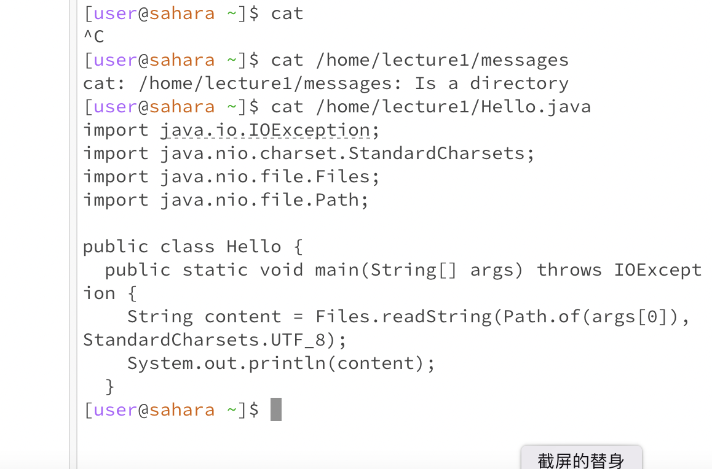
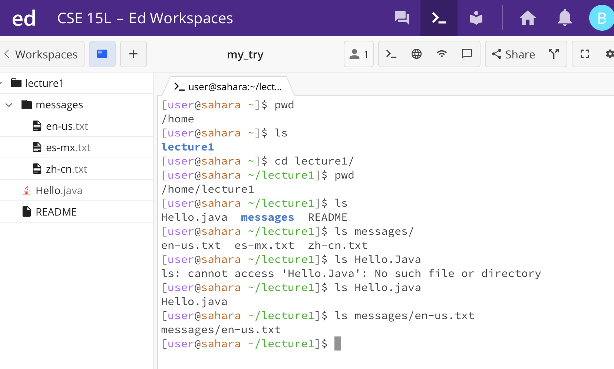
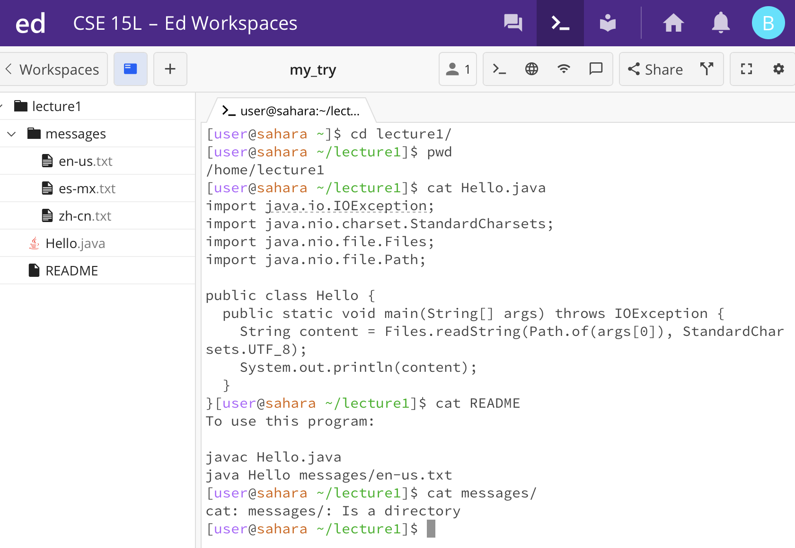
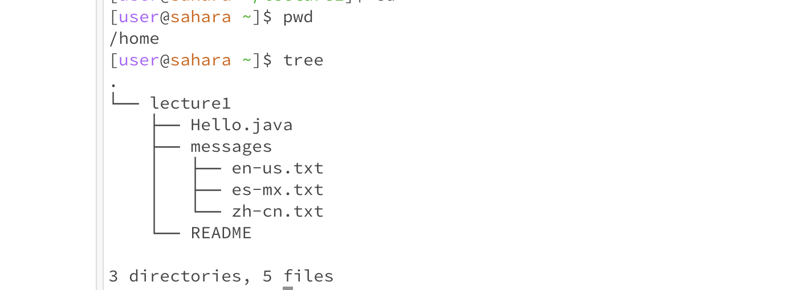

## The learned basic filesystem commands

* cd - "change directory" to switch the current working directory to the given path
  
      ```cd```  - the current working directory is: /home
      ```cd lecture1``` - the current working directory is: /home, then change directory to /home/lecture1
      ```cd /home/lecture1/Hello.java``` - current working directory is /home/lecture1, but wanna change directory to /home/lecture1/Hello.java. error. This is not a directory.
  
  

* ls - "list" to list the files and folders by the given path
  
      `ls` - working directory is: /home. It will list lecture1.
      `ls lecture1` - working directory is /home. It will list all folders and files under /home/lecture1.
      `ls /home/lecture1/messages/` - the working directory is /home. It will list all files under messages.
  
  

* cat - "concatenate" to print the contents of one or more files given by the paths
  
      `cat` - error. current working directory is: /home. The terminal will wait for inputing a file path.
      `cat /home/lecture1/messages` - error. working directory is: /home. /home/lecture1/messages is a directory, not a file path.
      `cat /home/lecture1/Hello.java` - working directory is: /home. It concatenates the content of the Hello.java and then print it on the terminal.
  
  
      
* pwd - "print working directory" can see the above pictures.

* find . -name "Hello.java"   - to find out the Hello.java file

* $HOME = ~ = /home
  
* / - represents the root

* .. - parent directory. the directory above or outside the current directory.
  
* . - no directory / no path. can be ignored.

* tree - will show the tree graph of the program files (also the relatives).
  The dot (.) at the beginning means the current location.
  

*** 

## Key words

- Absolute path             `/home/lecture1/README`
- Root folder/directory     ```/ or C:\\```
- Relative path             ```lecture1/README```
- Working directory
- Parent directory
- No directory/no path
- Environment variable : home
- http(s) URL
- Domain
- Path (part)
- Query
- Anchor (or Fragment)

**Happy Day! :)**
  
      
