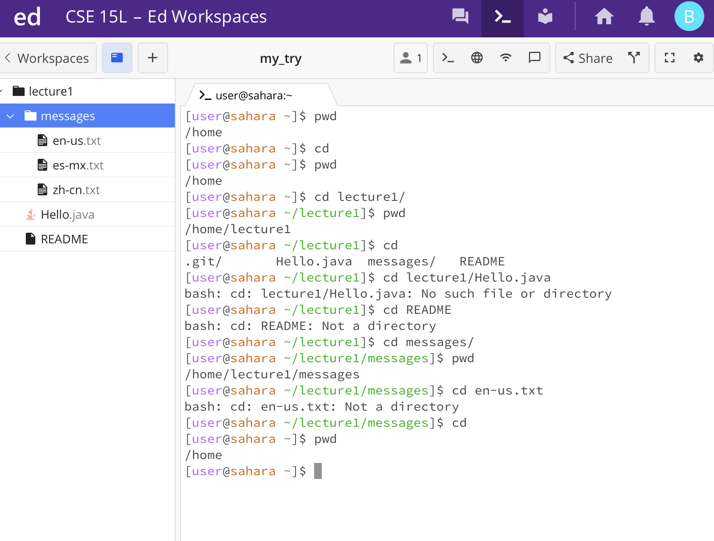
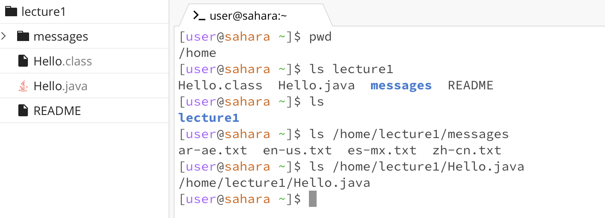

## The learned basic filesystem commands

* cd - "change directory" to switch the current working directory to the given path
  
      `cd`
      `cd lecture1`
      `cd /home/lecture1/Hello.java`
      

* ls - "list" to list the files and folders by the given path
  
      `ls`
      `ls lecture1`
      `ls /home/lecture1/messages/`
      

* cat - "concatenate" to print the contents of one or more files given by the paths
  
      `cat`
      `cat /home/lecture1/messages`
      `cat /home/lecture1/Hello.java`
      
      
* pwd - "print working directory" can see the above pictures.

* 
      
