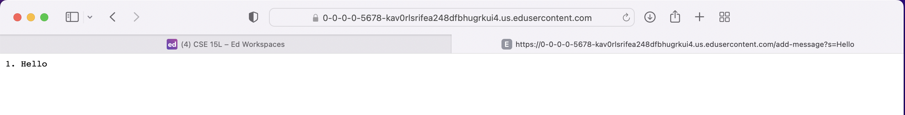
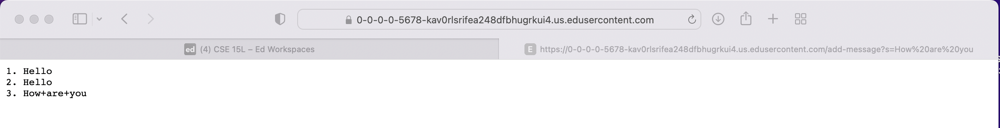
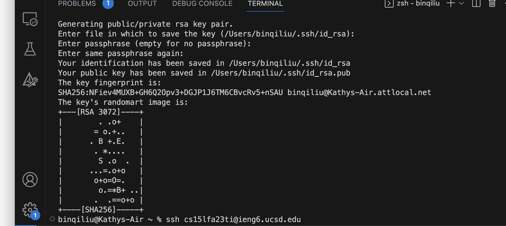
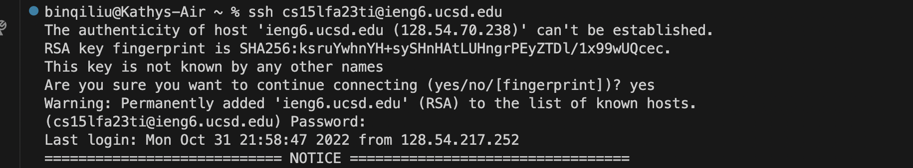
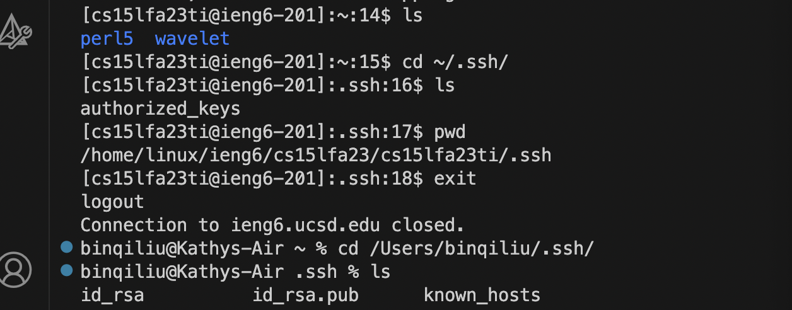
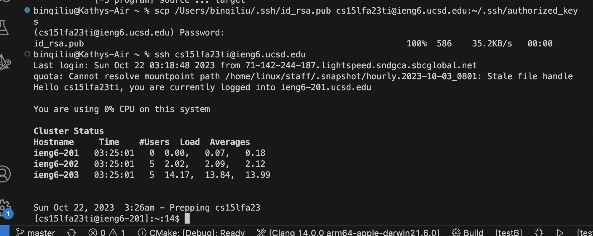
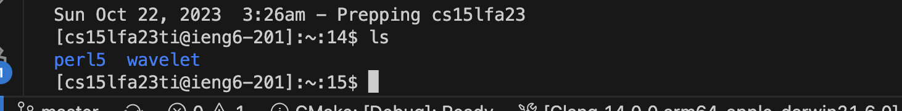

Part 1:
1. two screenshots of using /add-message for StringServer
   
   
3. for each of the 2 screenshots, describe:
   - which methods in your code are called?
   - what are the relevant arguments to those methods, and the values of any relevant fields of the class?
   - how do the values of any relevant fields of the class change from this specific request? if no values got changed, explain why.

Part 2:
1. the path to the private key for your SSH key for logging into ieng6 on the computer: ```/Users/binqiliu/.ssh/id_rsa.pud```
2. the path to the public key for the SSH key for logging into ieng6 within your account on ieng6: ```/home/linux/ieng6/cs15lfa23/cs15lfa23ti/.ssh/authorized_keys```
   
   
   
   
   
   Without password to log in the ieng6:
   

   ```ls``` list the folders and files under my ieng6:
   


Part 3:

   I didn't know ssh, curl, and scp before. I learned how to create an easy server in java and how to use the commands on the terminal to remotely compile/control my programs. 

